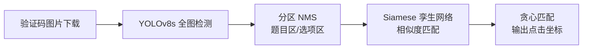

# B站评论采集系统

> 极验三代点选验证码全参数分析 | WBI 签名 | 无头浏览器自动化 | TK 桌面应用

## 项目概述

本项目的核心技术挑战是**分析极验三代（GeeTest v3）点选验证码**并完成 B站全链路自动登录，最终实现大规模评论数据采集。

不同于一般爬虫项目直接调用第三方打码平台，本项目从**协议层还原**了极验三代验证码的全部加密参数（w1/w2/w3），并结合 **YOLO + Siamese 双模型**实现点选坐标的端到端识别，是一套完整的"客户端指纹模拟 + 验证码识别 + 业务数据采集"解决方案。

## 技术栈

| 层次 | 技术 | 说明 |
|---|---|---|
| 协议分析 | Reqable | HTTP 抓包、请求对比 |
| 算法还原 | Python `pycryptodome` | AES-CBC + 自定义Base64 + RSA-1024 |
| 验证码识别 | YOLOv8s + Siamese Net (ONNX) | 全图目标检测 + 贪心匹配 |
| 轨迹模拟 | 贝塞尔曲线 + RLE 编码 | 极验三代 `$_BHIh` / `$_HDl` 轨迹压缩算法 |
| 浏览器自动化 | DrissionPage (Chromium) | 无头浏览器搜索 + 设备指纹提取 |
| WBI 签名 | HMAC-SHA256 + MD5 | B站新版 WBI 签名接口还原 |
| 数据存储 | MySQL + Redis | 评论持久化 + 视频ID队列 |
| GUI | Tkinter + Threading | 蓝白风格桌面应用，多线程防卡顿 |

## 核心分析模块

### 1. 极验三代点选验证码（核心亮点）

**需分析的参数：**

```
w1 参数：AES-CBC 加密配置 + 自定义 Base64 ($_HCB) + RSA 公钥加密
w2 参数：轨迹编码 ($_BHIh) + 指纹 ep/tm + MD5 + 设备信息
w3 参数：点击坐标 ca + 时间戳 + W2 校验 + RSA 签名
```

- **加密算法**：AES-128-CBC（自定义 iv）、RSA-1024（PKCS1_v1_5）、MD5
- **编码算法**：自定义 Base64 变体（`$_HCB` / `$_HEJ`），字符集 `A-Za-z0-9()`
- **轨迹压缩**：RLE + 类型编码 + 有符号整数压缩 —— 将数百个鼠标事件压缩为几十字符
- **设备指纹**：WebGL 渲染器、GPU 型号、时间戳、DOM 事件序列

**识别流程：**



- `click_identify.py`：YOLO + Siamese ONNX 推理，CPU 运行无需 GPU
- `bilibili_login.py`：w1/w2/w3 参数构造、轨迹生成、完整登录流程

**参考标准：** 极验三代 `click.3.1.2.js` + `fullpage.9.2.0.js`

### 2. B站 WBI 签名还原

B站 2024 年启用的新版 WBI 签名机制，从 `img_key` + `sub_key` 派生 `mixin_key`，对请求参数做 MD5 签名。

- `comment.py: BiliAuth` — 完整实现 `get_bili_ticket()` + `get_wbi_sign()`

### 3. 翻页游标修复

通过 Reqable HAR 抓包对比发现：B站评论接口 `pagination_reply` 返回 `next_offset`，但翻页请求参数名必须为 `offset`。字段名不匹配导致第 2 页起全部返回缓存数据（20 条重复但 `code=0`），属典型的**服务端静默反爬**。

## 项目结构

```
bilibili-comment-collector/
├── main.py              # TK 桌面应用入口
├── comment.py           # 评论采集核心（WBI签名、分页、MySQL写入）
├── bilibili_login.py    # 登录模块（极验三代全参数还原 + 验证码识别）
├── click_identify.py    # 验证码识别（YOLOv8s + Siamese 双模型）
├── get_id.py            # 无头浏览器搜索视频ID
├── model/
│   ├── yolov8s.onnx     # YOLOv8s 目标检测模型
│   └── siamese.onnx     # Siamese 孪生网络模型
└── requirements.txt     # Python 依赖
```

## 快速开始

```powershell
# 1. 安装依赖
pip install -r requirements.txt

# 2. 启动 Redis 和 MySQL（使用默认端口和密码）

# 3. 启动应用
python main.py
```

**操作流程：**

```
搜索关键词 → 导入视频到列表 → 输入账号密码 → 点击登录（自动过极验） → 登录成功后采集评论
```

登录支持最多 3 次自动重试，验证码识别失败或密码错误均会自动刷新验证码重新尝试。

## 技术难点与解决方案

| 难点 | 解决方案 |
|---|---|
| 极验三代 w 参数还原 | 分析 `click.3.1.2.js`，还原 AES+RSA+自定义Base64 全链路 |
| 轨迹编码压缩 | 分析 `$_BHIh` 函数，实现 RLE + 类型编码 + 有符号整数压缩 |
| 点选坐标识别 | YOLO 全图检测 + 分区 NMS + Siamese 贪心匹配，CPU 推理 < 1s |
| B站二级风控（短信验证） | 无头浏览器提取设备指纹，减少风控触发 |
| 翻页数据重复 | Reqable 抓包对比浏览器/脚本请求差异，定位 `offset` 字段名问题 |
| 403 权限拦截 | 每页刷新 `bili_ticket` + WBI 密钥对，保持设备指纹一致 |

## 项目亮点

- **极验三代全参数协议还原**：分析 `click.3.1.2.js` / `fullpage.9.2.0.js`，还原 w1/w2/w3 全链路加密（AES-CBC + 自定义 Base64 `$_HCB` + RSA-1024 + MD5），纯 Python 实现，零第三方打码依赖
- **YOLO + Siamese 双模型点选识别**：YOLOv8s 全图检测 + 分区 NMS + Siamese 贪心匹配，CPU 推理 < 1s，无需 GPU
- **轨迹编码算法分析**：还原极验三代压缩算法（RLE + 类型编码 + 有符号整数编码），将数百个鼠标事件压缩为几十字符，通过行为风控检测
- **B站 WBI 签名 + 翻页游标修复**：全方位还原新版 WBI 签名机制，通过 Reqable 抓包对比修复 `pagination_reply` 字段名不匹配导致的服务端静默反爬
- **桌面应用工程化**：Tkinter 多线程桌面应用，集成无头浏览器自动化、登录重试、MySQL 批量写入、Redis 队列管理

## License

MIT

## 免责声明

本项目仅用于**技术研究与学习**，严禁用于任何商业用途或非法爬取行为。使用者须自行承担一切法律责任，开发者概不负责。
